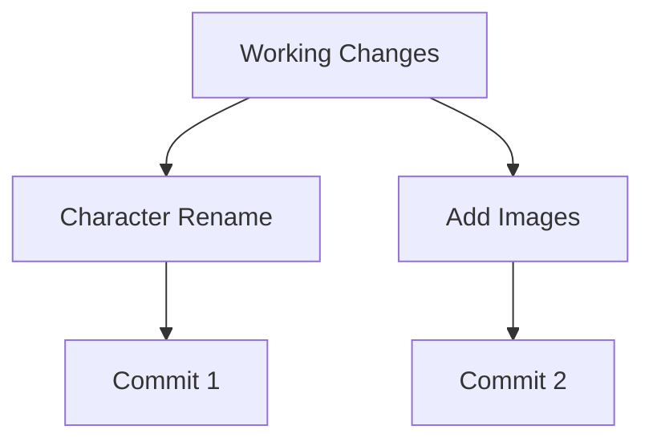
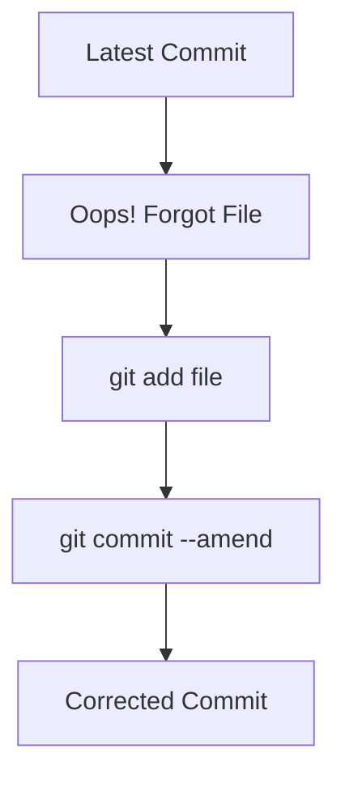

# 📘 Git Notes - Committing in More Detail

> Comprehensive notes based on the section covering Git documentation, atomic commits, commit messages, editors, git log, Git GUIs, amending commits, and .gitignore.

---

# 🎯 Topics Covered

- 📚 Git Documentation
- ⚛️ Atomic Commits
- ✍️ Writing Good Commit Messages
- 🖥️ Configuring VS Code as Git Editor
- 📜 git log --oneline
- 🎨 Git GUI (GitKraken)
- 🔄 Amending Commits
- 🚫 .gitignore

---

# 📚 Git Documentation

## Git Documentation Structure

```text
Git Documentation
│
├── Reference Manual
└── Pro Git Book
```

### Reference Manual

Use when you need:

```bash
git commit
git log
git branch
```

and want to understand available flags and syntax.

### Pro Git Book

Use when learning concepts:

```text
Git Basics
Branching
Merging
Remotes
Workflows
```

---

# ⚛️ Atomic Commits

## Definition

An Atomic Commit represents one logical unit of work.

✅ One feature
✅ One bug fix
✅ One refactor

## Good Example

```text
Commit 1
Rename Gatsby to Catsby

Commit 2
Create mood board
```

## Bad Example

```text
One Commit
├── Rename Character
├── Add Images
├── Fix Bug
└── Update Documentation
```

## Diagram



---

# ✍️ Writing Good Commit Messages

## Recommended Style

Use Present Tense Imperative Style.

### Good

```text
Add login page
Fix authentication bug
Update README
Create dashboard
```

### Weak

```text
Changes
Updated stuff
Work done
```

## Structure

```text
Verb + Object
```

Example:

```text
Fix checkout validation bug
```

---

# 🖥️ Configure VS Code as Git Editor

## Configure

```bash
git config --global core.editor "code --wait"
```

## Flow

```text
git commit
    │
    ▼
VS Code Opens
    │
    ▼
Write Message
    │
    ▼
Save & Close
    │
    ▼
Commit Created
```

---

# 📜 git log --oneline

## Standard Log

```bash
git log
```

## Compact Log

```bash
git log --oneline
```

### Example Output

```text
7fa1d28 Fix typo
9ab7c22 Add mood board
1ae9d10 Rename Gatsby to Catsby
```

## Internal Equivalent

```bash
git log --pretty=oneline --abbrev-commit
```

---

# 🎨 Git GUI (GitKraken)

## GUI vs CLI

### CLI

```bash
git add file.txt
git commit -m "Add feature"
```

### GUI

```text
Select File
↓
Stage
↓
Write Message
↓
Commit
```

## Visualization

```text
Repository
│
├── Commit A
├── Commit B
└── Commit C
```

---

# 🔄 Amending Commits

## Purpose

Fix the latest commit.

## Command

```bash
git commit --amend
```

## Scenario

Forgot a file.

```bash
git add outline.txt
git commit --amend
```

## Flow



---

# 🚫 .gitignore

## Purpose

Ignore files and folders that should not be tracked.

## Common Cases

### Secrets

```text
API Keys
Passwords
Tokens
```

### Dependencies

```text
node_modules/
```

### Logs

```text
*.log
```

### OS Files

```text
.DS_Store
Thumbs.db
```

## Example .gitignore

```gitignore
.DS_Store
node_modules/
secrets.txt
*.log
.env
```

## Project Diagram

```text
Project
│
├── src/                 ✅ Track
├── package.json         ✅ Track
├── .gitignore           ✅ Track
│
├── node_modules/        ❌ Ignore
├── .env                 ❌ Ignore
├── secrets.txt          ❌ Ignore
└── server.log           ❌ Ignore
```

---

# 🔥 Interview Questions

## What is an Atomic Commit?

A commit representing a single logical change.

## What does git commit --amend do?

Allows modification of the most recent commit.

## Why use .gitignore?

To prevent tracking of dependencies, secrets, logs, and generated files.

## Why use git log --oneline?

To view concise commit history with abbreviated hashes.

---

# 📝 Cheat Sheet

```bash
# Commit
 git commit -m "Add feature"

# Open editor
 git commit

# Configure VS Code
 git config --global core.editor "code --wait"

# Show history
 git log

# Compact history
 git log --oneline

# Amend latest commit
 git commit --amend

# Create gitignore
 touch .gitignore
```

---

# ✅ Key Takeaways

- Keep commits atomic.
- Write meaningful commit messages.
- Use git log --oneline frequently.
- Use amend for quick corrections.
- Configure a comfortable editor.
- Never commit secrets.
- Always use .gitignore for dependencies and sensitive files.
